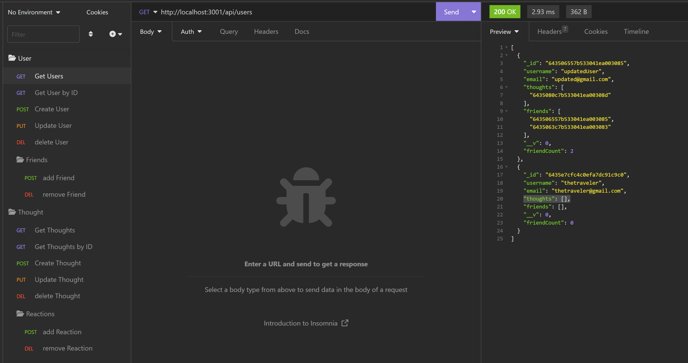
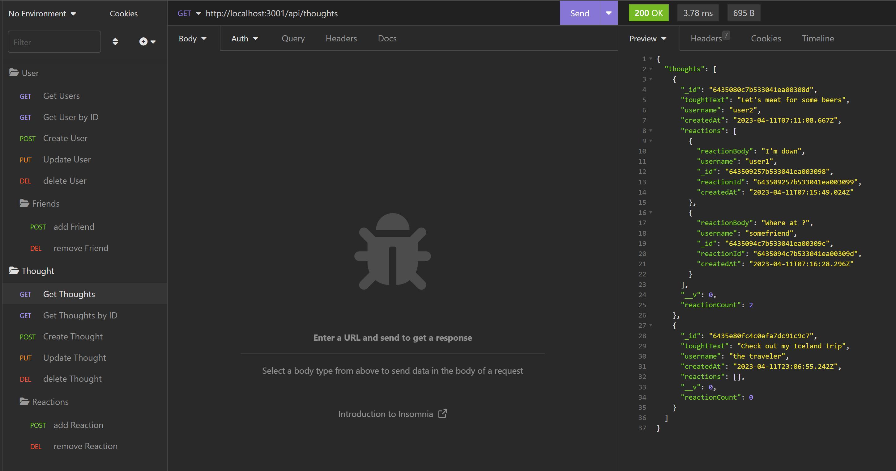

# NoSQL Social Network API
  
  
## Description
  An API for a social network web application where users can share their thoughts, react to friends’ thoughts, and create a friend list. The data is stored in MongoDB.
  
  - Link to video walk-through: https://drive.google.com/file/d/1zk0Xt2I9w5UeH6SwJ6L5nQ5rDS9uQ2aP/view

  #### Table of contents:
  - [Description](#description)
  - [Instalation](#installation)
  - [Usage](#usage)
  - [License](#license)
  ---
  
  ## Installation
  - Make sure MongoDB is isntalled on the machine
  - Install dependecies by running `npm i`
  - Start server `npm start`

  ## Usage
    The API has a number of endpoints.
    - GET, POST, PUT, DELETE `/api/users`
    - GET `/api/users/:userId`
    - GET, POST, PUT, DELETE `/api/thoughts`
    - GET `/api/thoughts/:thoughtId`
    - POST, DELETE `/api/users/:userId/friends/:friendId`
    - POST, DELETE `/api/users/:thoughtId/reactions`

  ## License
  This application is covered under the [MIT License](LICENSE)

  ---

### Screenshots

---

